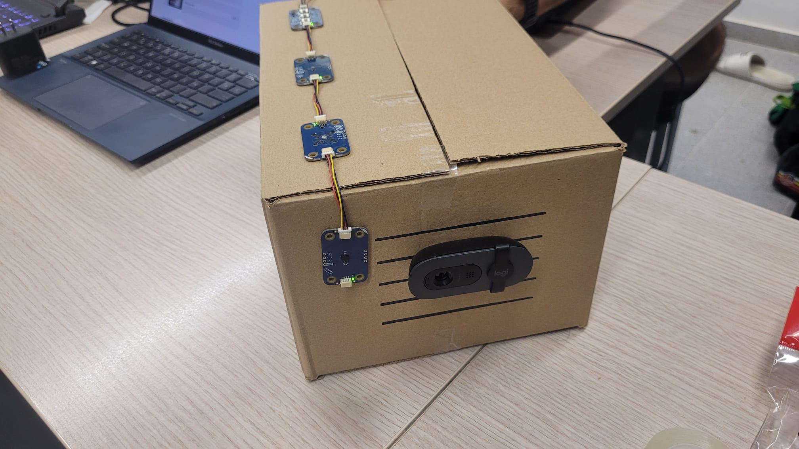
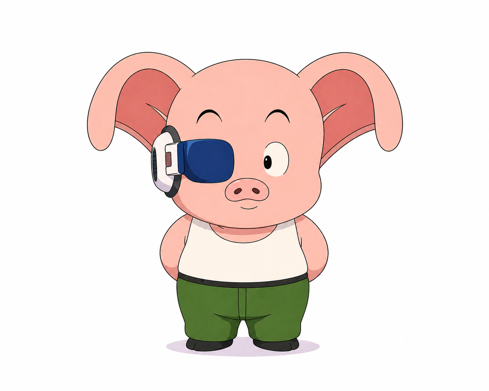

# guAIta

Edge AI monitoring proof of concept for Collserola wild boar detection and operational response.

## Project Summary

guAIta demonstrates a practical shift from static, costly manual surveillance to event-driven response.

Instead of relying on people to watch every forest access point, low-cost edge stations detect wild boars locally and send only meaningful events. The dashboard turns those events into an operational view with map alerts, risk zones, recommendations, timelines, and escalation status.

The technical centerpiece is the Arduino UNO Q. Inference runs on the device, not in the server cloud path.

## Objective

The challenge objective is to build an Edge AI solution for a more biodiverse and more resilient Barcelona.

For guAIta, that means following wild-boar activity in Collserola with local, on-device AI inference on Arduino UNO Q, in the context of African swine fever pressure and high public spending on static forest guard coverage.

Our objective is to help public teams move from blanket surveillance to targeted response based on observed risk.

This objective is aligned with the HackUPC judging criteria:

- Creativity and Relevance: original and relevant response to a Barcelona green-resilience challenge.
- Technical Execution: efficient on-device Edge AI performance, including practical accuracy and latency.
- Impact and Scalability: clear potential for deployment across multiple public-space monitoring points.

## Why Build It

Collserola is expensive and difficult to monitor continuously with static patrols.

guAIta is positioned as a public-resource optimization system:

- move from patrol cars waiting everywhere to edge devices watching continuously
- dispatch teams only where observed risk is visible
- reduce unnecessary static coverage while improving reaction speed

This directly fits HackUPC 2026 requirements: Edge AI centered, Arduino UNO Q centered, and local on-device inference.

## System Overview

The solution uses one shared event model for real device events, scenario events, and manual demo events.

- Edge device: Arduino UNO Q + camera + optional Modulino sensors, local model inference, HTTP JSON sender
- Backend: Fastify + TypeScript + SQLite + Zod + deterministic risk scoring + deterministic recommendations + Socket.IO
- Dashboard: Vite + React + TypeScript + MapLibre + Tailwind, with map-first operational UI

## Quick Start

### Prerequisites

- Node.js 22.x
- npm
- optional: ngrok for public tunnel tests

### Install and Run

```bash
npm install
cp .env.example .env
npm run dev
```

This starts:

- backend: http://localhost:3000
- frontend: http://localhost:5173

### Useful Commands

```bash
npm run typecheck
npm run build
npm run reset-demo
```

### Health Check

```bash
curl http://localhost:3000/health
```

Full local setup and tunnel instructions: [docs/local-development.md](docs/local-development.md)

## How We Built It (Implementation)

### 1) Arduino UNO Q, Sensors, and On-Device AI

The edge station runs on Arduino UNO Q with a USB camera and Modulino sensors. Inference runs locally on the device, and only compact event data is sent to the server.

Hardware used in the current implementation:

- Camera: wild-boar visual detection input.
- Modulino Distance: proximity context and station awareness.
- Modulino Thermo: temperature and humidity context.
- Modulino Light: ambient light context (day/night activity clues).
- Modulino Buttons:
	- button A toggles active/standby station mode
	- button B toggles bounding-box overlay metadata for snapshots/live stream

Implementation references:

- [guaita-arduino/README.md](guaita-arduino/README.md)

The Python app reads sensor values through Bridge RPC calls and keeps local station state (`active`, `show_bounding_boxes`) synchronized with the Arduino sketch.

### 2) Edge Impulse Model and Sliding Window Filter

The model is trained with a wild-boar dataset in Edge Impulse using a FOMO detection pipeline, then deployed on-device.

The model is intentionally tiny and optimized for low latency. In Edge Impulse profiling, the core model block is in the sub-millisecond range (<1 ms); end-to-end station latency also includes camera capture, filtering, and network posting.

In the device runtime:

- detector runs with a permissive per-frame gate (`VideoObjectDetection(confidence=0.1, debounce_sec=0.0, ...)`) to avoid missing candidates
- the decision gate is a rolling/sliding window in `on_all_detections`
- defaults:
	- `THR_FRAMES = 20`
	- `CONFIDENCE_THR = 0.7`

Trigger rule:

- collect confidence for each frame (`0.0` when no boar class is detected)
- when the window is full, compute average confidence
- fire alert only when average confidence >= threshold

Why this matters:

- reduces single-frame noise and false positives
- tolerates brief occlusions/low-light misses without resetting all context
- keeps behavior deterministic for demo and operations

### 3) Data Paths: Detection, Telemetry, and Live Frames

The station sends data with HTTP POST in three complementary paths:

1. Detection events (`/api/device/events`)
- source, station, species, confidence, observed time
- optional snapshot (`snapshot.data` base64 JPEG/PNG)
- optional telemetry context attached to the event

2. Periodic telemetry (`/api/device/telemetry`)
- sent every `METRICS_INTERVAL` seconds (default 30)
- keeps environmental/device context updated even without detections

3. On-demand live camera frames
- dashboard requests a stream session
- device polls `/api/device/stream-state`
- if active, device uploads low-rate frames through `/api/device/stream-frames/pipe`

This design keeps inference at the edge while sending only operationally useful payloads.


### 4) Backend Validation, Storage, Risk, and Realtime

Backend stack: Fastify + TypeScript + SQLite + Socket.IO.

Key implementation points:

- Zod validation in shared schemas (`packages/shared/src/schemas.ts`)
- unified detection schema for `device`, `scenario`, and `manual` sources
- deterministic event normalization and severity estimation
- optional snapshot validation/storage, exposed via:
	- `GET /api/events/:eventId/snapshot`
- telemetry stored independently and also derived from detection context when available
- realtime push via Socket.IO events:
	- `detection.created`
	- `telemetry.created`
	- `call.updated`
	- scenario and stream update events

### 5) Frontend Operational Flow

The dashboard (`apps/web/src/App.tsx`) starts by loading stations, zones, events, telemetry, calls, and scenario state from REST endpoints, then subscribes to Socket.IO for live updates.

What the UI does in operations mode:

- renders Collserola map with stations, zones, and detection pulses
- shows latest detection details and station telemetry
- tracks alert escalation state and call progress
- supports manual simulation for deterministic demo flow

Evidence and live viewing path:

- detection snapshots are stored server-side and retrievable through `event.imageUrl` / snapshot endpoint
- live camera is supported through stream-session endpoints and MJPEG image streaming
- stream metadata (status/frame/boxes) is broadcast over Socket.IO while image bytes are streamed separately

### 6) Human Interaction and ElevenLabs Escalation

When a high-risk detection is active, the operator can trigger Civil Protection escalation from the dashboard.

Flow:

1. Dashboard POSTs `/api/calls/civil-protection` for the active event.
2. Server creates a call record in SQLite.
3. If `CALLS_ENABLED=true`, server triggers ElevenLabs outbound call.
4. ElevenLabs receives incident dynamic variables (station, severity, confidence, pattern context).
5. Acknowledgement and post-call webhooks update call status in realtime.

Implementation references:

- `apps/server/src/domain/civil-protection-calls.ts`
- `apps/server/src/server.ts`
- [docs/voice-escalation.md](docs/voice-escalation.md)

## Business Case and Social Impact

The PPA (African swine fever) context around Catalonia has already activated large-scale containment costs: fencing, surveillance operations, emergency staffing, and control contracts over a very large area.

From the current research base:

- static patrol coverage is expensive (Guardia Urbana tariff proxy: EUR 109.23/hour)
- significant emergency public spending is already active
- the pork sector exposure is measured in billions of euros
- producer losses are already measured in tens/hundreds of millions

Catalonia also has a very large pig population (around eight million in cited reporting), so containment failure risk is economically and operationally serious.

Public impact is not only financial. Access restrictions and park-pressure episodes affect daily life for residents who rely on Collserola for mobility, sport, and wellbeing.

guAIta's proposed scaling model:

- deploy many low-cost edge stations across forest borders and high-risk access points
- monitor continuously with local inference
- escalate only when observed risk justifies action

This is the core value proposition: lower-cost, more targeted, and more scalable response than blanket static guarding.

<p align="center">
	
	
</p> 