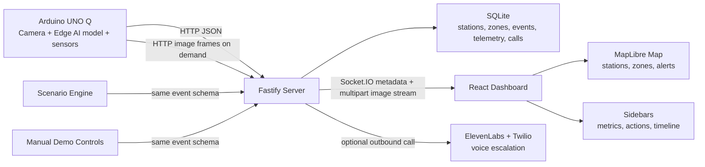

# Architecture

## Goal

Build a reliable demo system where a real or simulated edge device detects wild boars, sends compact events to a server, and a realtime dashboard shows operational risk, recommendations, and scenario progress.

## Core Constraints

- The Arduino UNO Q must remain the technical centerpiece.
- The dashboard should work before the hardware path is complete.
- Device events and simulated events must share one schema.
- The demo should be deterministic enough to rehearse.
- The backend should be small enough to understand under hackathon pressure.

## System Overview



## Runtime Data Flow

1. A device, scenario, or manual control creates a detection event.
2. The backend validates the event with shared Zod schemas.
3. The backend stores the event in SQLite.
4. The risk engine assigns severity using station, zone, confidence, and scenario context.
5. The action recommender creates one or more recommended actions.
6. Socket.IO broadcasts the new detection, alert, and action to connected dashboards.
7. The frontend updates the map, sidebars, metrics, and event graph.
8. The operator may open a live viewer for any station. The server stores an in-memory stream session; the Arduino polls for that session and uploads low-rate JPEG or PNG frames while it is active.
9. Device detections and the manual Edge AI simulation are escalation-worthy alerts. They do not place calls automatically; the dashboard operator must press **Call Civil Protection** to create the call record and optionally start an ElevenLabs outbound call with the incident packet.
10. Scenario detections remain ambient context in the map and timeline; they do not replace the primary call-worthy alert.
11. ElevenLabs acknowledgement and post-call webhooks update the stored call and broadcast `call.updated`.

During local development the server clears runtime demo data on startup by default (`DEMO_RESET_ON_START=true`) and starts with live device detections disarmed (`DEVICE_EVENTS_ENABLED_ON_START=false`). The dashboard `Listen from device` switch arms the backend listener. The backend auto-disarms it after one accepted device detection or after `DEVICE_EVENTS_ARM_TTL_MS`, so a running Arduino cannot accidentally create duplicate demo incidents. Calls are only started by the dashboard operator action.

Telemetry follows the same transport and station identity, but it is stored as sensor context instead of as a detection. Devices post periodic readings to `/api/device/telemetry`; the backend stores them, broadcasts `telemetry.created`, and the dashboard shows the latest reading per station.

Live camera viewing is separate from detection ingestion. Dashboard stream sessions are short-lived and in memory only. Device frames are not persisted; only detection snapshots are saved to disk for later evidence review. The device keeps one persistent multipart upload open while streaming; the browser consumes frames through a separate multipart image stream, while Socket.IO carries only stream metadata and box coordinates. Button B on the Arduino controls whether live box metadata is sent and displayed; detection snapshots are annotated with model boxes when coordinates are available while inference remains on-device.

## Proposed Monorepo Layout

```text
apps/
  server/
    src/
      index.ts
      routes/
      domain/
      db/
      seeds/
      scenarios/
  web/
    src/
      app/
      features/
      theme/

packages/
  shared/
    src/
      schemas.ts
      types.ts
      events.ts

docs/
  decisions/
```

## Backend Responsibilities

- Expose device ingestion endpoint.
- Expose scenario controls.
- Store events, stations, zones, actions, and scenario runs.
- Run deterministic risk scoring.
- Run deterministic action recommendations.
- Broadcast realtime updates through Socket.IO.
- Serve the built frontend in demo/production mode.

Primary routes:

```text
GET  /health
POST /api/device/events
GET  /api/device/listening
PUT  /api/device/listening
GET  /api/device/stream-state
POST /api/device/stream-frames
POST /api/device/stream-frames/pipe
POST /api/device/stream-frames/raw
GET  /api/streams/:stationId
GET  /api/streams/:stationId/image-stream
POST /api/streams/:stationId/start
POST /api/streams/:stationId/stop
GET  /api/events
GET  /api/telemetry
GET  /api/telemetry/latest
GET  /api/stations
GET  /api/zones
GET  /api/actions
GET  /api/calls
POST /api/device/telemetry
POST /api/calls/civil-protection
POST /api/calls/civil-protection/acknowledge
POST /api/calls/elevenlabs/post-call
POST /api/scenario/start
POST /api/scenario/pause
POST /api/scenario/resume
POST /api/scenario/advance
POST /api/scenario/reset
POST /api/manual/events
POST /api/demo/reset
```

## Frontend Responsibilities

- Render the live operational map.
- Show fixed stations and fixed risk/containment zones.
- Show detection pulses, alert severity, and optional movement direction.
- Show scenario controls and virtual time.
- Show key metrics and event graphs.
- Show active alerts, evidence, and recommended actions.
- Clearly distinguish live device events from scenario/manual events.

Preferred dashboard layout:

```text
left sidebar: scenario controls, virtual time, station summary, metrics
center: full map with stations, zones, detections, response markers
right sidebar: active alert, evidence, recommended action, action status
bottom: event timeline and detection graph
```

## Database Shape

SQLite is enough for the MVP. Seed files should remain the editable source for stations, zones, and scenarios.

Suggested tables:

```text
stations
zones
events
telemetry_readings
alerts
recommended_actions
calls
scenario_runs
```

Do not add a large ORM unless the project clearly needs it. Prefer a tiny database wrapper and explicit SQL.

## Realtime Model

Use Socket.IO between server and browser.

The Arduino/device does not use Socket.IO. It posts HTTP JSON only.

Suggested realtime events:

```text
detection.created
telemetry.created
telemetry.cleared
stream.session.updated
stream.frame
device.listener.updated
alert.created
action.created
action.updated
call.updated
calls.cleared
station.updated
scenario.started
scenario.paused
scenario.resumed
scenario.advanced
scenario.reset
```

## Scenario And Clock Model

Scenario time is virtual and controllable. Device events are real-time.

- Scenario events follow `currentTimeMs`.
- Scenario can be paused, resumed, advanced, or reset.
- A live Arduino/device event is accepted only when the backend device listener is armed, then pauses a running scenario and creates an operator-reviewed alert.
- Additional device detections are ignored while an active device call is `requested`, `calling`, or `completed`.
- The UI should label live events clearly.

## Action Recommendation Model

The MVP recommender is deterministic and rule-based. It should create useful, explainable actions from event context.

Examples:

- Deploy civil protection unit near a busy access point before morning peak.
- Dispatch wildlife response to a containment frontier.
- Send cleaning crew to an urban/trash-adjacent zone with rising detection rates.
- Increase nearby station sampling after repeated low-confidence events.

LLM-generated explanation is a v2 plugin, not an MVP dependency.
